# taskflow-gitops — dépôt GitOps du cours CI/CD M2

Ce dépôt décrit **l'état voulu** de l'application TaskFlow dans Kubernetes.
Argo CD le surveille et aligne le cluster dessus : pour changer la production,
on ne tape pas de commande, on fait une **Pull Request**.

## Installation (à faire chez vous, avant le cours)

Prérequis : Docker Desktop démarré, 8 Go de RAM, 10 Go de disque libre.
Sous Windows : WSL2 (Ubuntu) + intégration WSL de Docker Desktop, et toutes les commandes dans WSL.

```bash
git clone https://github.com/9m7fjfpv9k-cyber/taskflow-gitops.git
cd taskflow-gitops
./scripts/install.sh
```

Le script crée un cluster local `kind`, installe Argo CD et Argo Rollouts,
puis télécharge les images des labs. Comptez 5 à 15 minutes.
Il peut être relancé sans risque.

## Structure

| Chemin | Rôle |
| --- | --- |
| `apps/taskflow/` | Les manifests surveillés par Argo CD |
| `argocd/application.yaml` | Déclare l'application dans Argo CD |
| `exemples/bluegreen/` | Manifests pour le déploiement Blue-Green |
| `exemples/canary/` | Manifests pour le déploiement Canary |
| `exemples/robustesse/` | Canary avec test de charge k6 automatique, modèle de postmortem |
| `exemples/ci/` | Pipelines de la mini-PSSI (GitHub Actions et GitLab CI) |
| `policies/` | Mini-PSSI et règles Rego vérifiées par conftest |
| `scripts/install.sh` | Installation de l'environnement |
| `scripts/argocd-ui.sh` | Ouvre l'interface d'Argo CD |
| `scripts/observe.sh` | Montre quelle version répond, et avec quel code HTTP |
| `scripts/charge.sh` | Lance à la main le test de charge k6 contre un service |

## Images disponibles

`ghcr.io/9m7fjfpv9k-cyber/taskflow` en versions `1.0.0`, `1.1.0`, `2.0.0`, `2.1.0` et `2.2.0`.

## Équipe

<!-- Noms du binôme -->
- Jallow Abdoulie (`jabdoulie`)
- Hannan Hassif (`123Hassif`)

## Journal des déploiements

Cluster `kind-cicd`. Argo CD surveille `https://github.com/jabdoulie/taskflow-gitops.git`, branche `main`, avec `automated.prune` et `automated.selfHeal`.

### Réponses

**Pull.** Argo CD va chercher l'état dans Git. Après chaque merge sur `main`, l'interface passe à **Synced** toute seule (`Auto sync is enabled`). Aucun `kubectl apply` des manifests n'est refait : le seul `kubectl apply` du journal sert à déclarer l'Application.

**Qui a corrigé quoi.**

| Changement | Auteur | Relecture et merge | Effet sur le cluster |
| --- | --- | --- | --- |
| PR #1, fork et binôme (`993090b`) | jabdoulie | 123Hassif | Application Healthy sur le fork |
| PR #2, image `2.0.0` (`7bd9009`) | 123Hassif | jabdoulie | Déploiement en `2.0.0` |
| Dérive `scale` à 1 et image `1.1.0` | jabdoulie, en direct sur le cluster | Argo CD (`selfHeal`) | Retour à 4 replicas et à l'image de Git |
| PR #3, revert de la #2 (`7028150`) | jabdoulie | 123Hassif | Retour de l'image à `1.0.0` |
| PR #4, suppression de `service.yaml` (`4cd5f52`) | jabdoulie | 123Hassif | Le Service disparaît (`prune`) |
| PR #6, Rollout blue-green (`cbef46e`) | jabdoulie | 123Hassif | Deployment remplacé, image encore `1.0.0` |
| PR #7, image `1.1.0` (`8972e60`) | jabdoulie | 123Hassif | Preview en `1.1.0`, prod en `1.0.0` jusqu'au promote |
| PR #8, stratégie canary (`5503144`) | jabdoulie | 123Hassif | Rollout canary, image tenue en `1.1.0`, Service preview retiré |
| PR #9, image `2.0.0` (`e9baef2`) | jabdoulie | 123Hassif | Canary jusqu'à 100 %, prod en `2.0.0` |
| PR #10, image `2.1.0` (`07ffacf`) | jabdoulie | 123Hassif | 25 % de `2.1.0`, des HTTP 500, puis abort |
| PR #19, image `2.1.0` avec analyse (`6853b55`) | jabdoulie | 123Hassif | L'analyse k6 échoue, abort automatique, stable reste en `2.0.0` |
| PR #20, image `2.2.0` (`ed69cd1`) | jabdoulie | 123Hassif | Analyse réussie, production en `2.2.0` |

**Pourquoi `git revert`.** Le bouton Revert ajoute un commit qui annule la PR #2, puis ce commit passe par une PR. L'historique de `main` reste en place, le ruleset n'est pas contourné, et Argo CD déploie ce nouveau commit (`7028150`) : l'image redevient `1.0.0`.

### 1. Premier déploiement en `1.0.0`

Contexte `kind-cicd`, Application créée, puis `./scripts/observe.sh` : les 40 requêtes répondent `version=1.0.0` en HTTP 200.

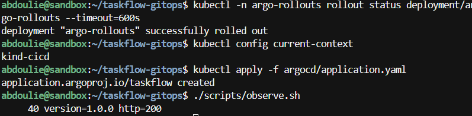

L'application est **Healthy** et **Synced** sur `main`. Le Service, le Deployment et les 4 pods sont là.

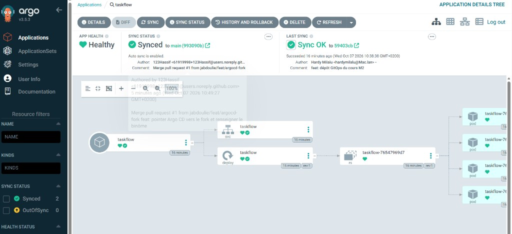

Le commit déployé ensuite est le merge de la PR #1 (`993090b`), le 7 octobre 2026 à 10:49. Hannan (`123Hassif`) a mergé le commit qui pointe Argo CD vers le fork.

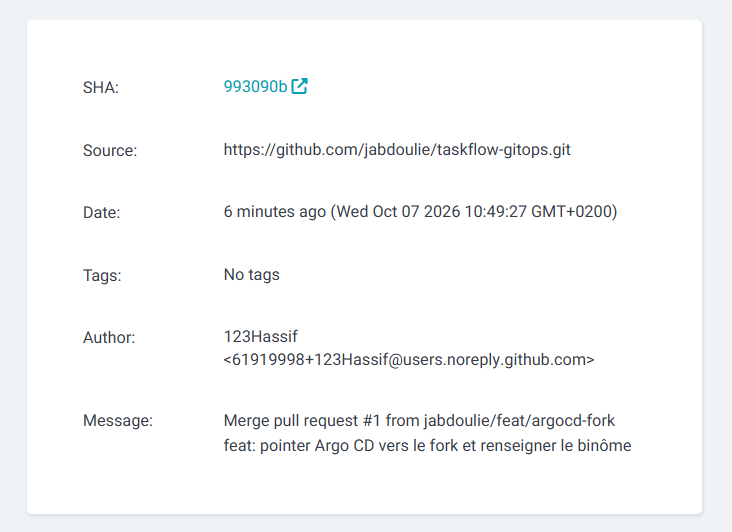

### 2. PR image `2.0.0`

PR #2, branche `update-image-version-2.0.0` : Hannan passe l'image de `1.0.0` à `2.0.0`. La PR attend une approbation.

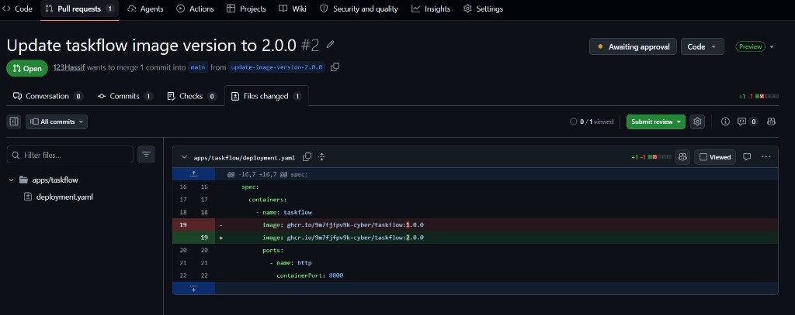

Après le merge par jabdoulie (`7bd9009`), Argo CD se synchronise seul. Le Deployment passe en révision 2.

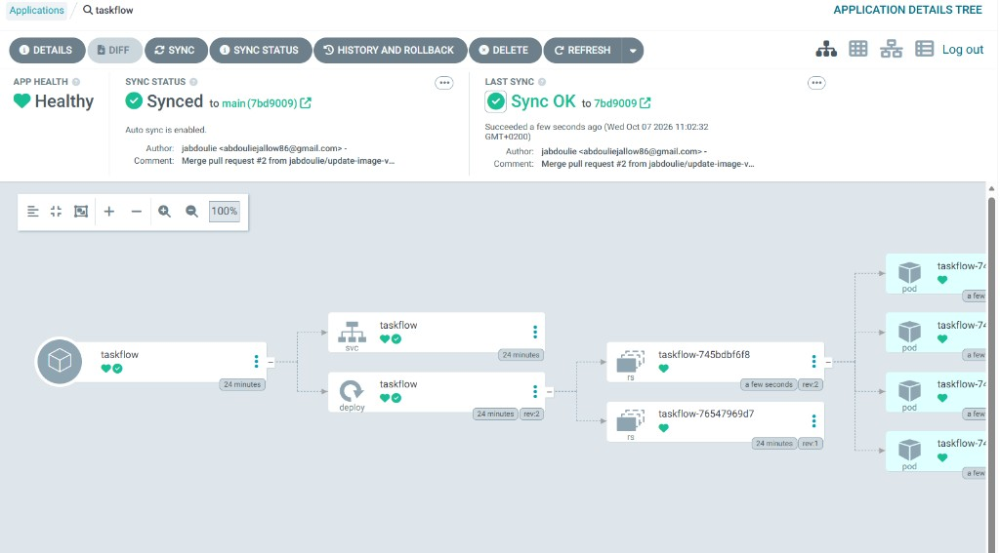

Le manifeste vivant du pod confirme l'image `ghcr.io/9m7fjfpv9k-cyber/taskflow:2.0.0` (ReplicaSet `745bdbf6f8`).

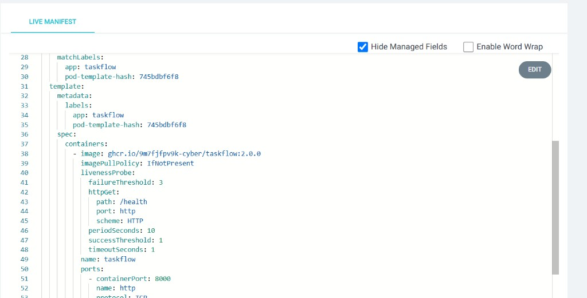

### 3. Dérive, puis self-heal

Commandes lancées sur le cluster, en dehors de Git : 1 replica, image `1.1.0`.

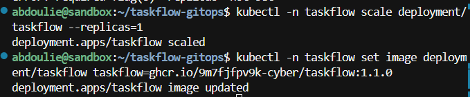

Argo CD corrige. Quatre pods repassent **Running** sur le ReplicaSet de Git (`745bdbf6f8`, image `2.0.0`). Les pods de la dérive passent **Terminating**. Le Service est encore présent.

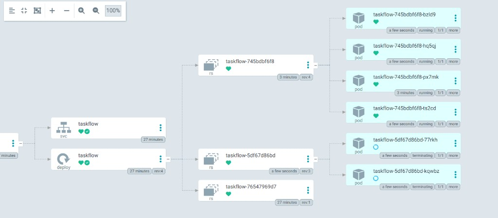

### 4. Revert vers `1.0.0`

PR #3, bouton Revert de la PR #2. jabdoulie ouvre le revert, 123Hassif l'approuve et le merge (`7028150`).

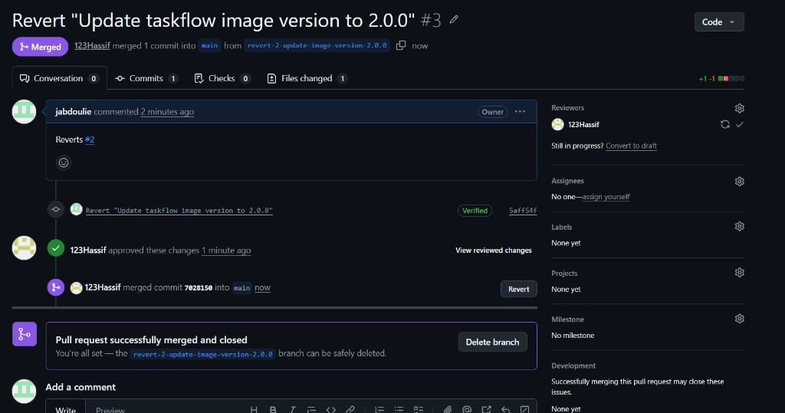

À 11:02 les pods `1.0.0` (`76547969d7`) avaient été supprimés pour laisser place à `2.0.0`. À 11:09 le revert les recrée.

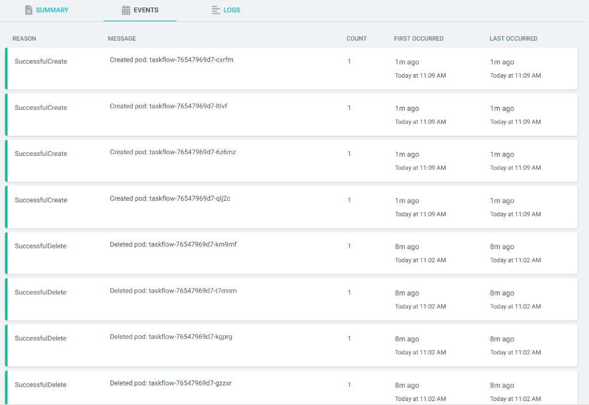

**Synced** sur `7028150`. Le ReplicaSet `76547969d7` (rév. 5) porte de nouveau les 4 pods. Le ReplicaSet `2.0.0` (`745bdbf6f8`) ne reçoit plus de trafic.

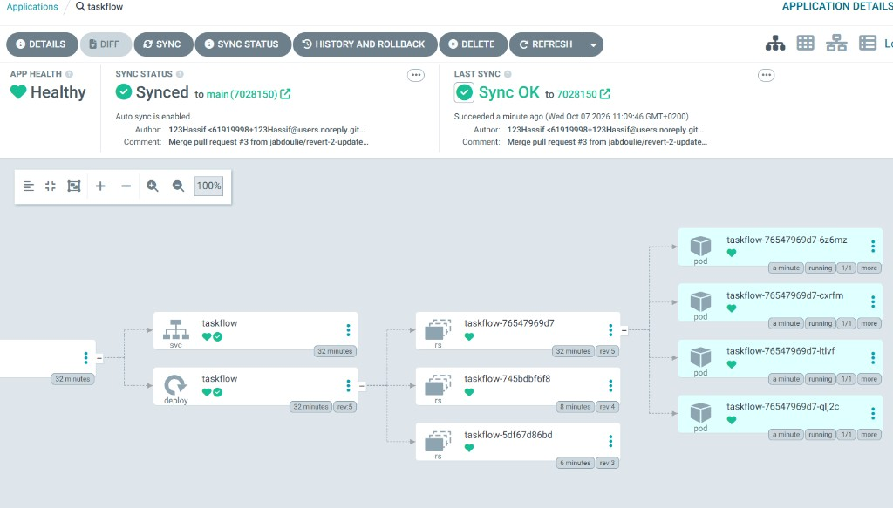

### 5. Bonus : prune du Service

PR #4, suppression de `apps/taskflow/service.yaml`. 123Hassif approuve et merge (`4cd5f52`).

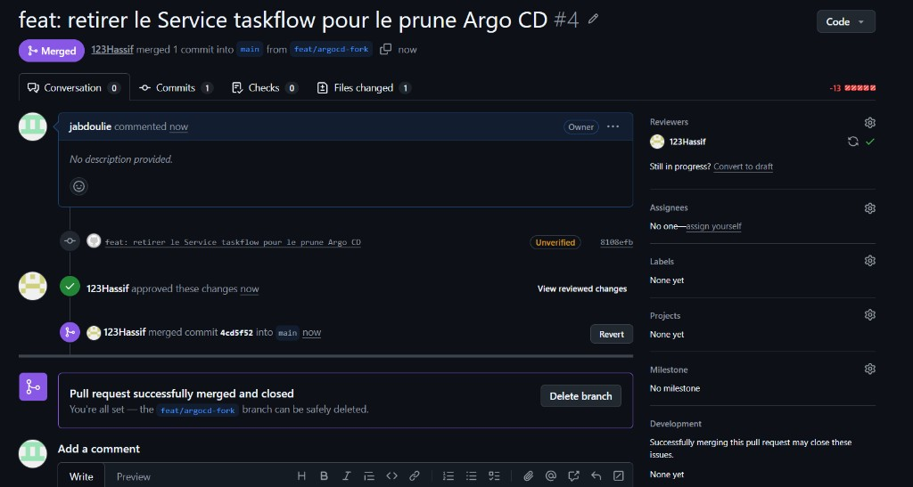

Quelques secondes plus tard, Argo CD est **Synced** sur `4cd5f52`. Le nœud Service a disparu de l'arbre. Le Deployment et les pods restent.

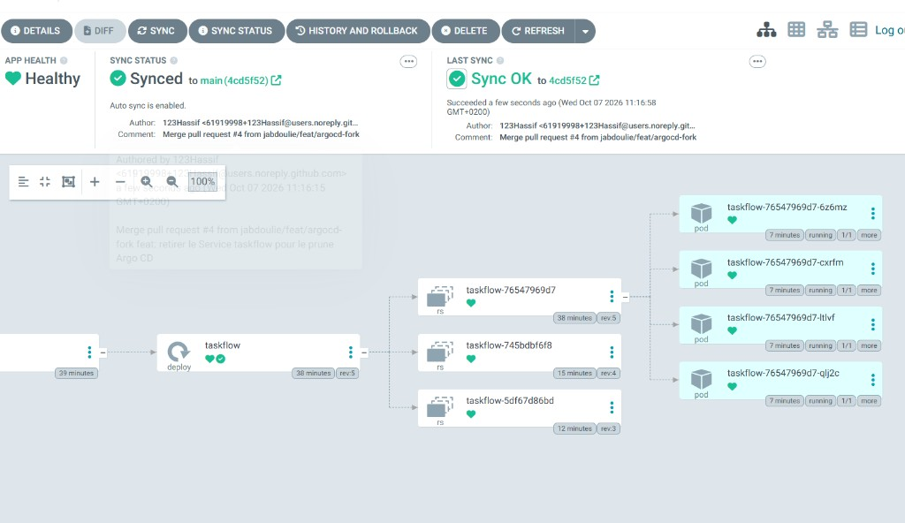

### 6. Blue-Green : `1.0.0`, puis `1.1.0`

PR #6, branche `feat/argocd-fork`. jabdoulie remplace `deployment.yaml` par le Rollout blue-green, et remet `service.yaml` plus `service-preview.yaml`. L'image reste `1.0.0`. 123Hassif approuve et merge (`cbef46e`, commit `0bbc521`).

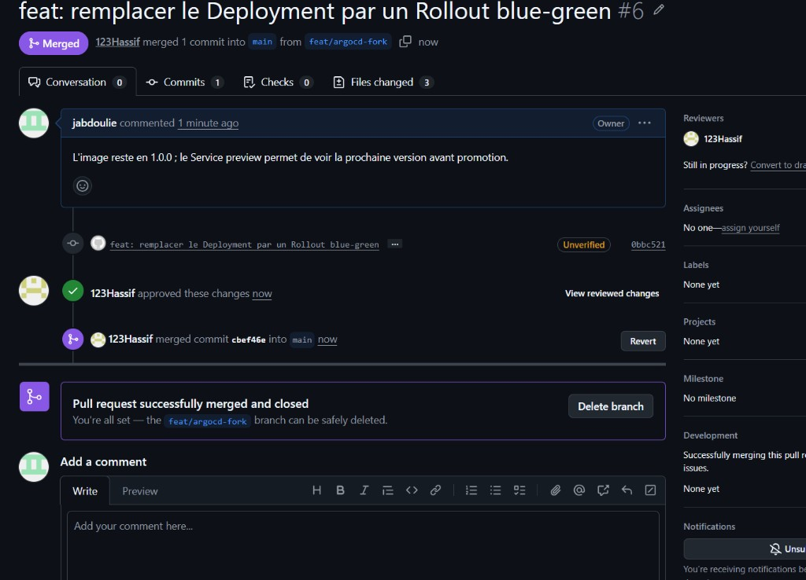

Argo CD passe **Healthy** et **Synced** sur `cbef46e`. Le Deployment a laissé la place au Rollout (rév. 1, ReplicaSet `5769dcb86c`). Les deux Services sont dans l'arbre. Quatre pods **Running**.

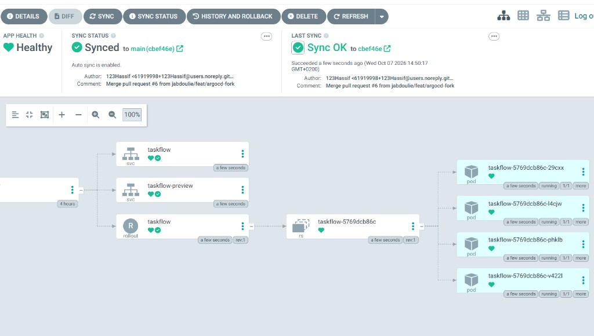

PR #7 : la même branche passe l'image à `1.1.0`. `autoPromotionEnabled: false`, donc la production ne bascule pas au merge. 123Hassif merge (`8972e60`, commit `25a6502`).

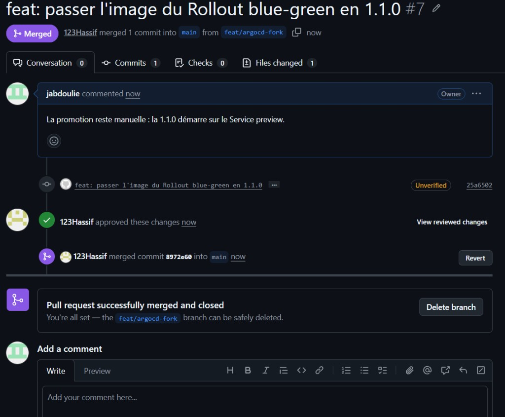

Le Rollout se met en **Paused** (`BlueGreenPause`). La révision 1 (`5769dcb86c`, `1.0.0`) reste **stable, active**. La révision 2 (`78cdc8775b`, `1.1.0`) est **preview**. Compteurs : Desired 4, Current 8, Updated 4. Huit pods **Running**, quatre par ReplicaSet.

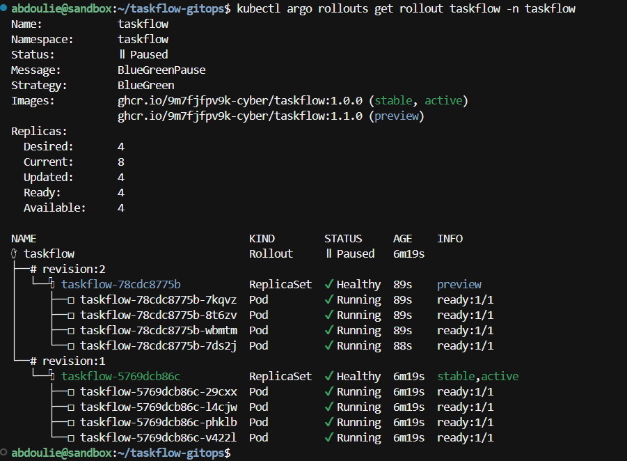

`./scripts/observe.sh` avant le promote : les 40 requêtes de `taskflow` répondent `version=1.0.0` en HTTP 200. Les 40 de `taskflow-preview` répondent `version=1.1.0` en HTTP 200. Les pods `observe-*` en **Completed** sont les restes des mesures précédentes.

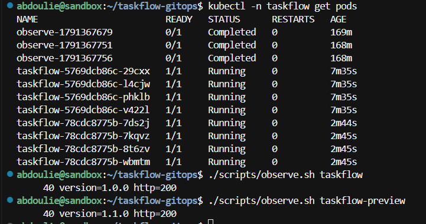

`kubectl argo rollouts promote taskflow -n taskflow` bascule les deux Services. Juste après, `taskflow` et `taskflow-preview` répondent chacun 40/40 en `version=1.1.0` HTTP 200. Le délai `scaleDownDelaySeconds: 30` laisse ensuite redescendre le ReplicaSet `5769dcb86c`.

### 7. Canary jusqu'à `2.0.0`

PR #8 : le Rollout passe en stratégie canary, l'image est tenue à `1.1.0`, et `service-preview.yaml` est retiré. 123Hassif merge (`5503144`, commit `ffa3c23`).

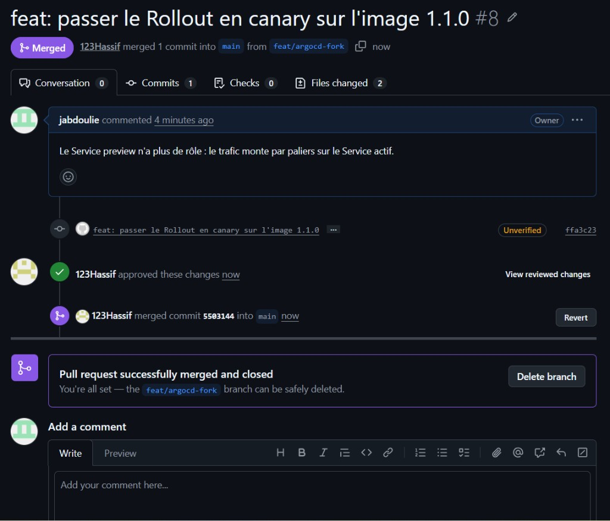

Argo CD est **Healthy** et **Synced** sur `5503144`. Le Service preview a disparu (`prune`). Le ReplicaSet actif est `78cdc8775b` (rév. 2, image `1.1.0`), quatre pods. Le ReplicaSet `5769dcb86c` (rév. 1) ne porte plus le trafic.

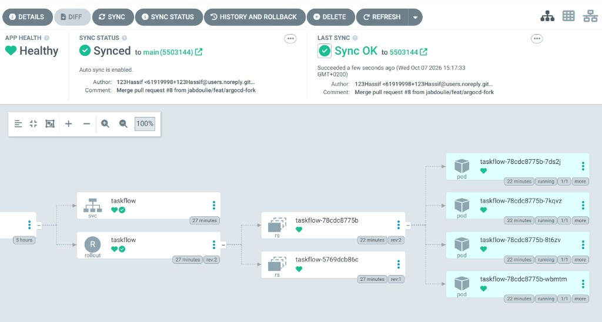

PR #9 passe l'image à `2.0.0`. 123Hassif merge (`e9baef2`, commit `f3f00f6`).

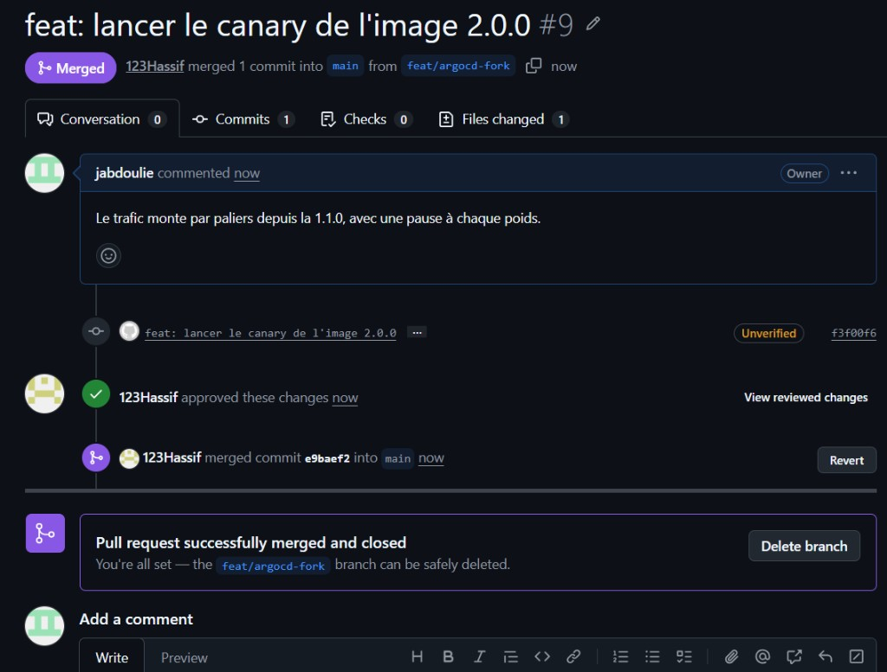

Au sync, Argo CD est **Progressing**. Le ReplicaSet `c6cf57bd6` (rév. 3) démarre son premier pod. Les quatre pods `78cdc8775b` (`1.1.0`) sont encore là.

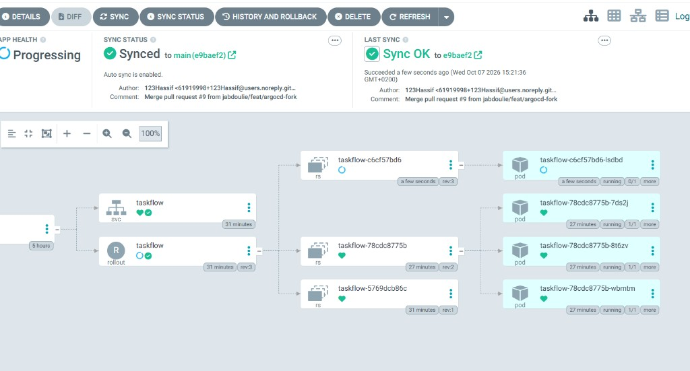

Le canary s'arrête au pas 1/6, `setWeight: 25`, **Paused** (`CanaryPauseStep`). `1.1.0` est **stable**, `2.0.0` est **canary**. Un seul pod sur `c6cf57bd6`, trois sur `78cdc8775b`. Desired et Current restent à 4.

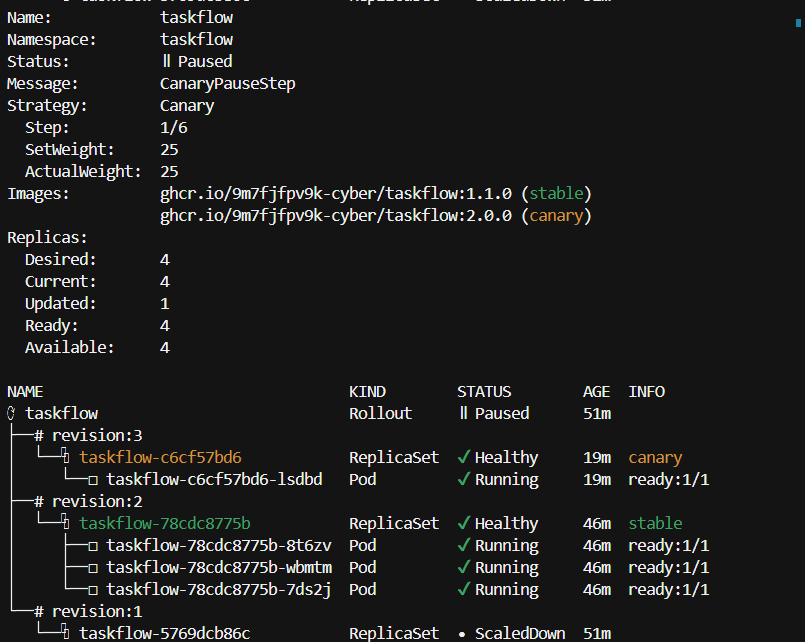

`./scripts/observe.sh taskflow` : 33 réponses `version=1.1.0` HTTP 200 et 7 réponses `version=2.0.0` HTTP 200. Sans maillage, le poids suit le nombre de pods : 1 pod sur 4. Sur 40 requêtes, 7 tombent sur `2.0.0`.

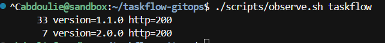

Chaque `kubectl argo rollouts promote` franchit la pause suivante. À 50 % (pas 3/6), Argo CD affiche **Suspended** : deux pods sur `c6cf57bd6`, deux sur `78cdc8775b`.

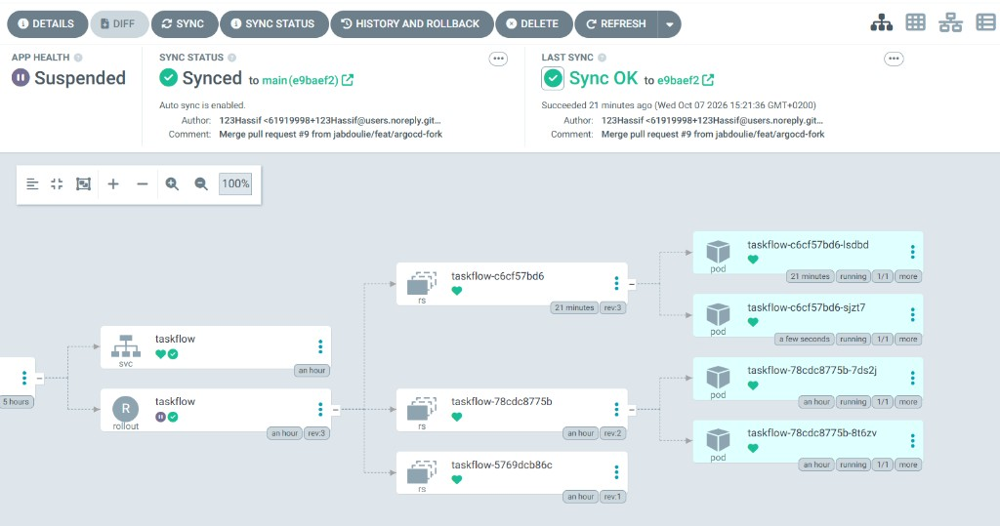

Le CLI confirme le pas 3/6, `ActualWeight: 50`, Updated 2.

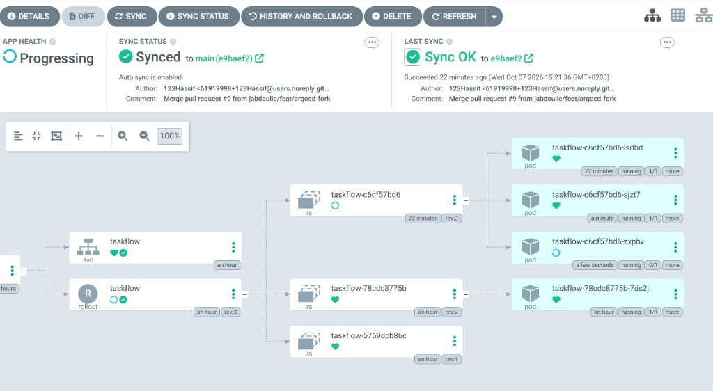

Au pas 5/6, `ActualWeight: 75`. Trois pods canary, un pod stable (`78cdc8775b-7ds2j`).

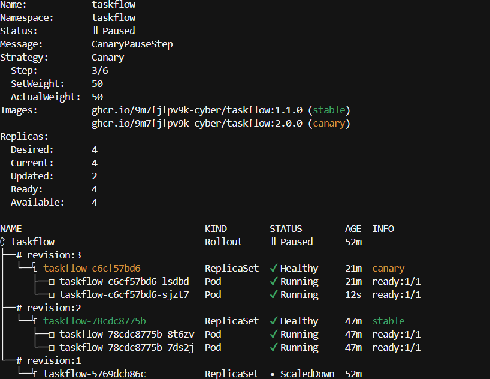

Pendant la montée, Argo CD repasse **Progressing** : un pod de `c6cf57bd6` est encore en 0/1, et un pod de l'ancienne révision reçoit encore du trafic.

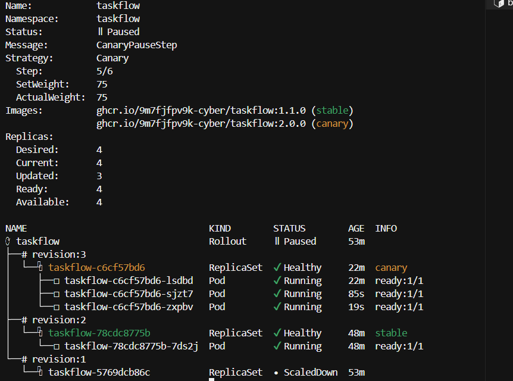

Au pas 6/6 le poids est à 100 %. Le Rollout est **Healthy**. `2.0.0` est devenue **stable**. Les quatre pods sont sur `c6cf57bd6`. Les ReplicaSets `78cdc8775b` et `5769dcb86c` sont **ScaledDown**.

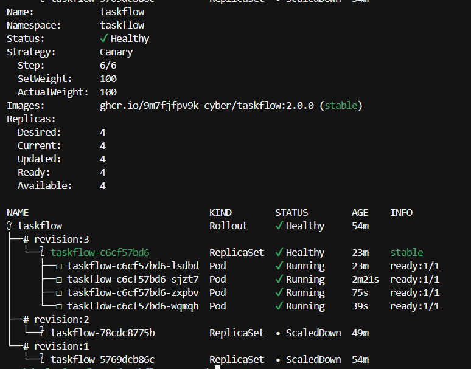

Argo CD est **Healthy** et **Synced** sur `e9baef2`. L'arbre ne montre plus que les quatre pods de la rév. 3.

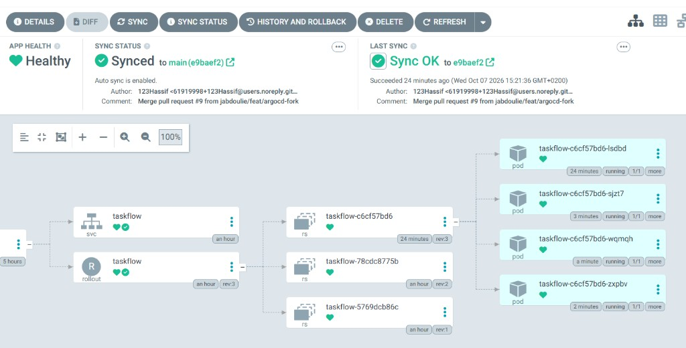

### 8. Canary `2.1.0`, codes HTTP, puis abort

PR #10 passe l'image à `2.1.0`. 123Hassif merge (`07ffacf`, commit `525b365`).

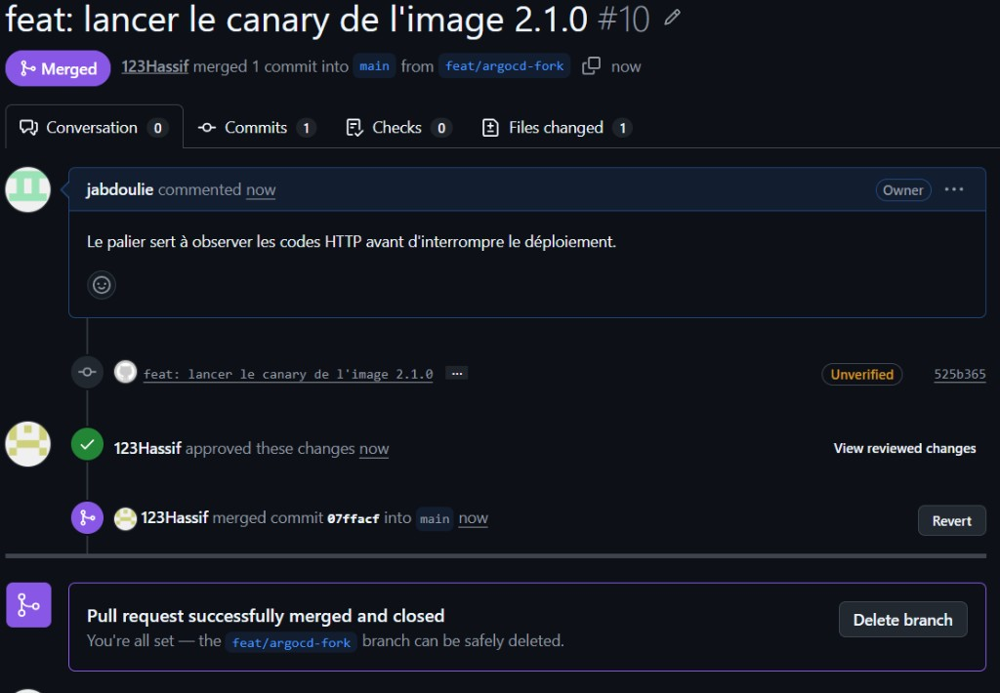

Argo CD est **Progressing** et **Synced** sur `07ffacf`. Le ReplicaSet `df976ccb5` (rév. 4) crée son pod ; le conteneur redémarre encore (`containerrecreating`). Les trois pods de `c6cf57bd6` (`2.0.0`) restent prêts.

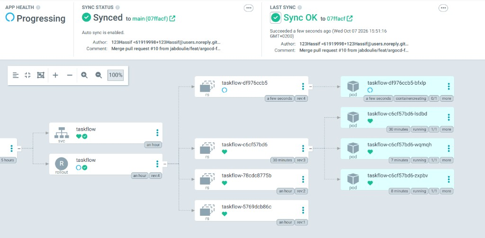

Le canary se fige au pas 1/6, poids 25 %. `2.0.0` est **stable** (3 pods, `c6cf57bd6`), `2.1.0` est **canary** (1 pod, `df976ccb5-bfxlp`). Deux mesures de 40 requêtes :

| Mesure | `2.0.0` HTTP 200 | `2.1.0` HTTP 200 | HTTP 500 |
| --- | --- | --- | --- |
| 1 | 30 | 9 | 1, `version=aucune` |
| 2 | 29 | 9 | 2, `version=aucune` |

Le corps des réponses 500 ne contient pas de champ `version`. Environ un quart des requêtes touche le pod `2.1.0`, et une partie de ces requêtes échoue.

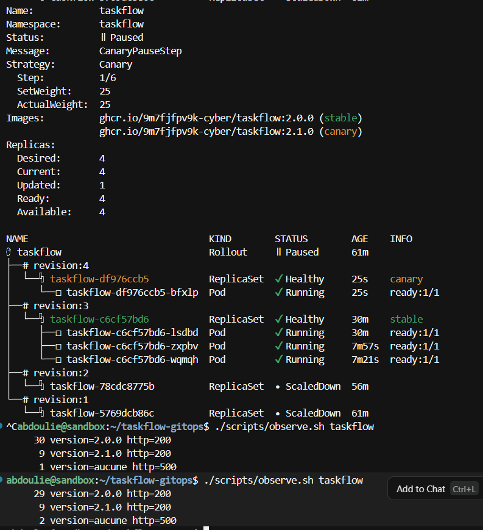

L'image porte la panne. `1.0.0`, `1.1.0` et `2.0.0` ont `FAILURE_RATE=0` et `LATENCY_MS=0`. Seule `2.1.0` a `FAILURE_RATE=0.3` et `LATENCY_MS=300`.

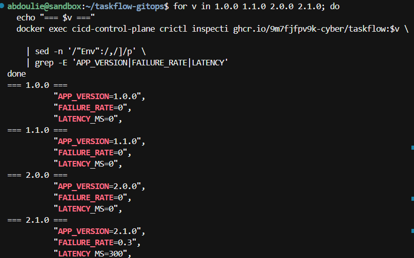

Dans `app/main.py`, le middleware `inject_faults` laisse passer `/health`. Sur les autres routes, il attend 300 ms, puis renvoie un HTTP 500 (`{"detail": "Erreur interne"}`) pour environ 30 % des requêtes, tirées au hasard. Ce corps n'a pas de champ `version`, d'où `version=aucune` dans `observe.sh`. Le readiness probe appelle `/health`, donc le pod canary reste `Ready` pendant que les utilisateurs prennent les 500.

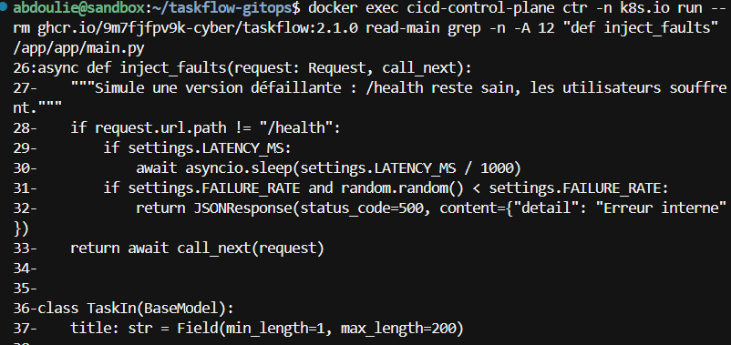

`kubectl argo rollouts abort taskflow -n taskflow` interrompt le palier. Argo CD reste **Synced** sur `07ffacf` (Git demande encore `2.1.0`) et la santé passe à **Degraded**. Le pod canary `df976ccb5-bfxlp` est encore là, à côté de trois pods `2.0.0`.

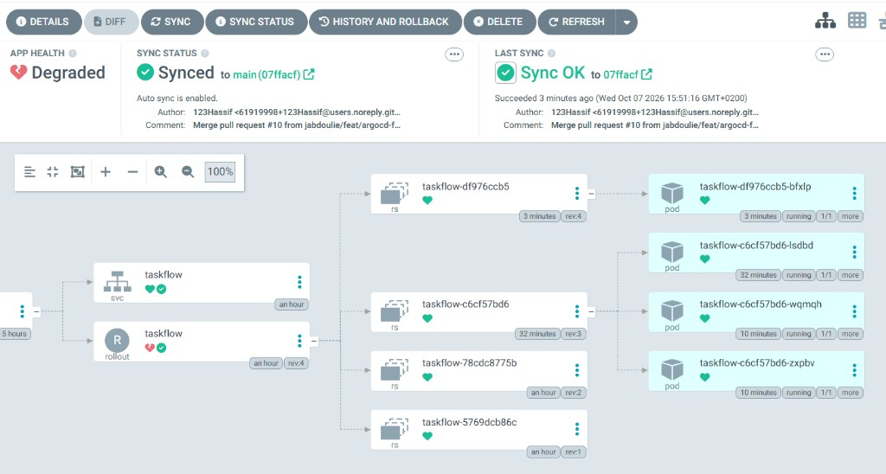

Le ReplicaSet stable `c6cf57bd6` revient à 4 pods. Le ReplicaSet `df976ccb5` ne porte plus le trafic. `./scripts/observe.sh taskflow` répond alors 40/40 `version=2.0.0` HTTP 200. Le Rollout reste **Degraded** : l'abort a rendu la main à la révision saine, et le commit `07ffacf` est toujours l'état voulu dans Git. Une PR qui remet l'image à `2.0.0` est ce qui resynchronise le spec avec la version qui répond.

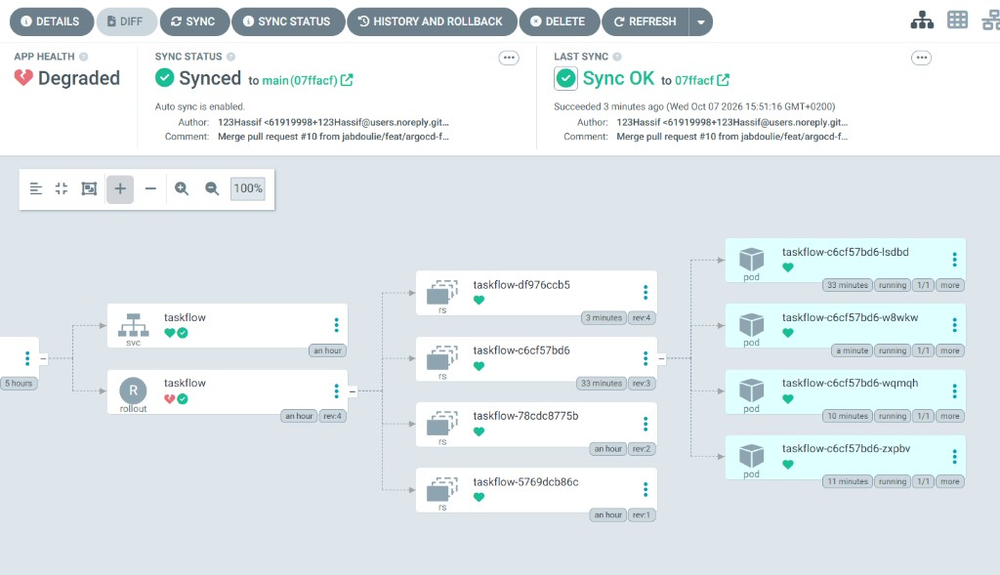

### Blue-Green ou Canary pour TaskFlow ?

Les deux stratégies ont livré une version saine (`1.1.0`, puis `2.0.0`). La `2.1.0` est celle qui a renvoyé des HTTP 500.

**Risque.** En blue-green, `taskflow` est resté 40/40 sur `1.0.0` tant que personne n'a promu. La `1.1.0` n'était visible que sur `taskflow-preview`, elle aussi 40/40 en HTTP 200. Le promote a ensuite envoyé 100 % du trafic d'un coup. En canary, le poids de 25 % a mis `2.0.0` puis `2.1.0` devant de vraies requêtes dès le premier palier : 7/40 pour la `2.0.0`, environ 10/40 pour la `2.1.0`, dont 1 puis 2 réponses HTTP 500. L'`abort` a rendu les 40 requêtes suivantes à `2.0.0` en HTTP 200, sans attendre un merge. Le dépôt, lui, dit encore `2.1.0`, donc Argo CD reste **Synced** et le Rollout **Degraded** jusqu'à une PR de retour.

**Coût.** Le blue-green a tenu 8 pods (Current 8, deux ReplicaSets de 4) pendant toute la pause, plus un second Service. Chaque pod demande 50m de CPU et 64 Mi : le chevauchement double ces demandes, et `scaleDownDelaySeconds: 30` garde les anciens pods encore trente secondes après le promote. Le canary est resté à 4 pods à chaque palier (1, puis 2, puis 3 pods neufs). Il n'ajoute pas de Service.

Pour TaskFlow, quatre replicas et pas de maillage, le canary est le bon choix. Une image qui répond 500 ne touche qu'une part des requêtes, et l'`abort` coupe cette part tout de suite. Le blue-green protège la production jusqu'au promote, au prix d'un second jeu complet de pods et d'un basculement total le jour où l'on promeut. Il convient quand la nouvelle version doit être essayée sur le preview sans aucune requête de production, et quand doubler les pods pendant la pause est acceptable.

### 9. Analyse automatique : `2.0.0`, `2.1.0`, puis `2.2.0`

Le détail de l'incident est dans [docs/postmortem-2.1.0.md](docs/postmortem-2.1.0.md).

Avant le canary, `./scripts/observe.sh taskflow` répond 40/40 `version=2.0.0` en HTTP 200.


`./scripts/charge.sh http://taskflow` lance le même scénario k6 que l'analyse : 30 secondes, 5 utilisateurs virtuels, sur le Service de production.

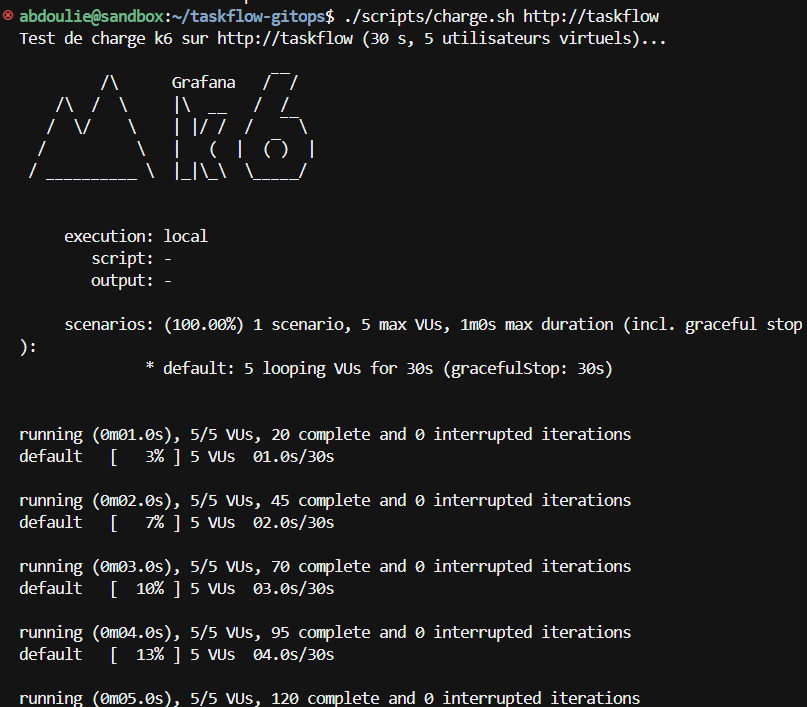

Après la pull request d'analyse, Argo CD montre la ConfigMap `k6-robustesse`, les Services `taskflow` et `taskflow-canary`, l'`AnalysisTemplate` `robustesse-k6` et le Rollout. Les pods actifs sont ceux du ReplicaSet `c6cf57bd6`.

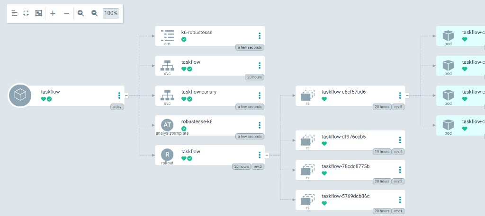

Les CRD `rollouts.argoproj.io`, `analysistemplates.argoproj.io` et `analysisruns.argoproj.io` sont là. `kubectl -n taskflow get deploy` répond `No resources found`.

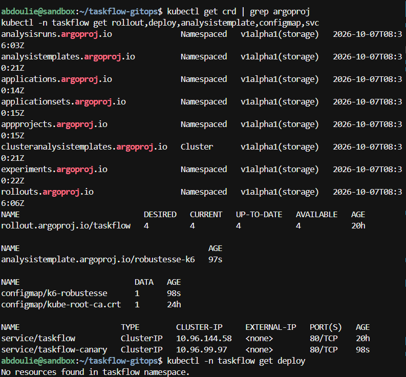

La première promotion en `2.1.0` (révision 6) ne s'avorte pas. L'`AnalysisRun` `taskflow-df976ccb5-6-1` et son Job k6 passent au vert, et les quatre pods `df976ccb5` prennent le trafic. k6 a mesuré la `2.0.0` : le sélecteur de `taskflow-canary` a basculé vers `df976ccb5` à la même seconde que le démarrage du Job, et les connexions sont restées sur l'ancien ReplicaSet.

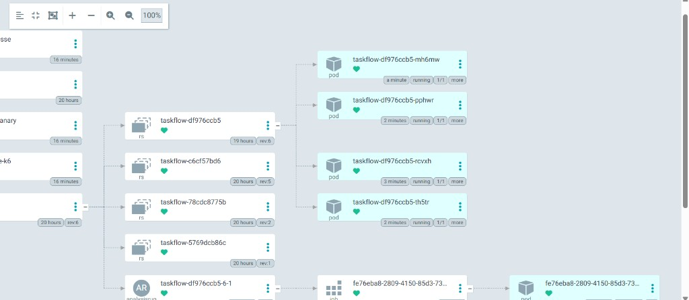

Une pause de 15 s est ajoutée avant l'analyse. Au passage suivant en `2.1.0` (révision 8, PR #19, `6853b55`), la métrique `test-de-charge-k6` échoue. Argo CD est **Degraded** et **Synced**. L'`AnalysisRun` `df976ccb5-8-2` est rouge. Le retour vers `2.0.0` (révision 7) a d'abord un échec (`c6cf57bd6-7-1`), puis un succès (`c6cf57bd6-7-2`).

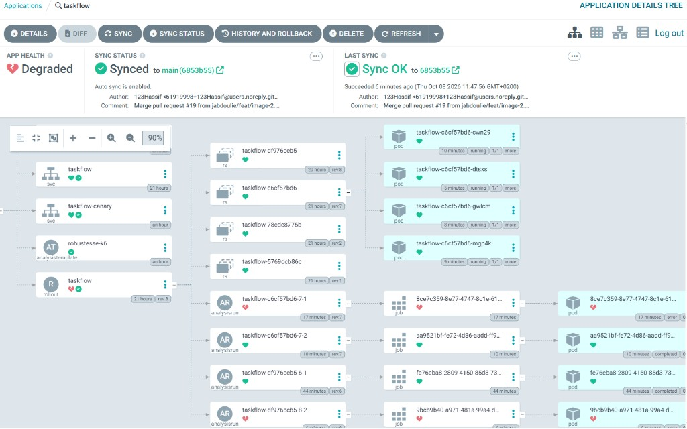

Le `--watch` confirme l'abandon automatique. Message : `Rollout aborted update to revision 8`, métrique `test-de-charge-k6` en échec, `failureLimit` à 0. Le poids retombe à 0. L'image stable est `2.0.0` (`c6cf57bd6`, 4 pods). Le ReplicaSet canary `df976ccb5` est **ScaledDown**.

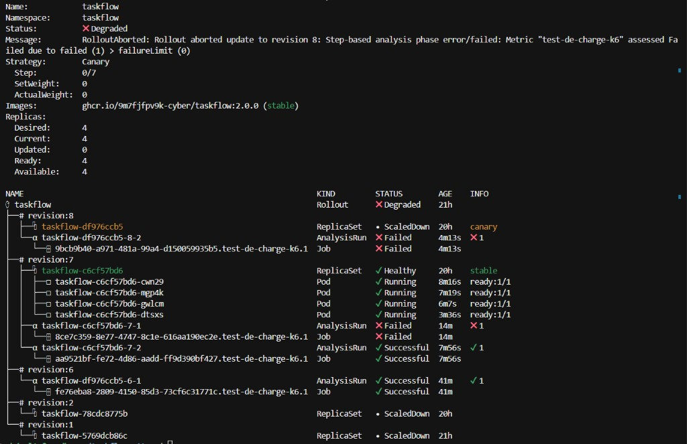

PR #20, `feat/image-2.1.0` vers `main`, commit `17554f2` : l'image passe en `2.2.0`.

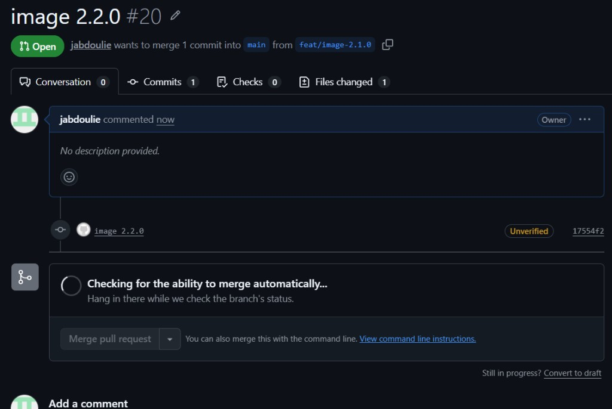

Après le merge (`ed69cd1`), Argo CD est **Suspended** et **Synced**. Le ReplicaSet `7ddd57d788` (rév. 9) démarre. L'`AnalysisRun` `7ddd57d788-9-2` lance son Job k6. Les pods `2.0.0` sont encore là.

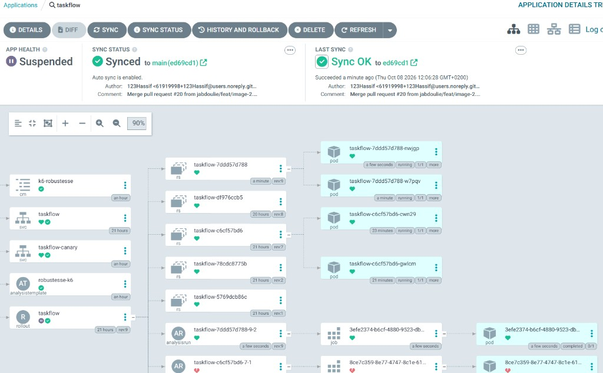

Un pod de cette révision tourne avec l'image `ghcr.io/9m7fjfpv9k-cyber/taskflow:2.2.0`, **Healthy**.

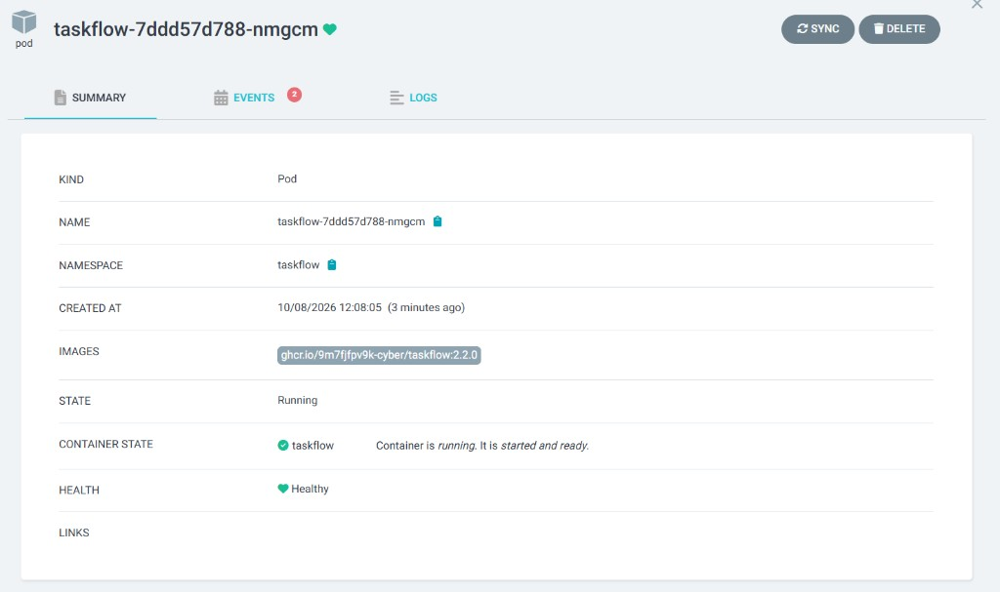

Le `--watch` finit **Healthy**, pas 7/7, poids 100 %. L'`AnalysisRun` `taskflow-7ddd57d788-9-2` est **Successful**. Les quatre pods sont sur `7ddd57d788`, et `2.2.0` est l'image stable.

### Livrable : La mini-PSSI en quality gates

Voici le tableau récapitulatif des règles de sécurité mises en place dans la pipeline d'intégration continue :

| Règle | Contrôle | Outil | Preuve |
| --- | --- | --- | --- |
| **PSSI-R1** | Toute image a un tag explicite, jamais \latest\ | **conftest** | Blocage CI lors de l'utilisation de ginx:latest\ |
| **PSSI-R2** | Les images viennent uniquement du registre autorisé | **conftest** | Blocage CI lors de l'utilisation de ginx:latest\ |
| **PSSI-R3** | Chaque conteneur a une limite de mémoire (esources.limits.memory\) | **conftest** | Règle ajoutée dans \kubernetes.rego\ et appliquée sur ollout.yaml\ |
| **PSSI-R4** | Les pods ne tournent jamais en root (unAsNonRoot: true\) | **conftest** | Ajout du \securityContext\ au niveau du pod dans ollout.yaml\ |
| **PSSI-R5** | Aucune vulnérabilité HIGH ou CRITICAL corrigeable | **Trivy** | Fichier \.trivyignore\ créé avec les exceptions datées pour l'image 2.2.0 |

#### Preuves de blocage (PR non conforme)

1. **Blocage Conftest (Règles R1 & R2)** : Lors de l'introduction de l'image ginx:latest\, la pipeline a bloqué le déploiement car l'image provenait d'un registre non autorisé et utilisait le tag \latest\.

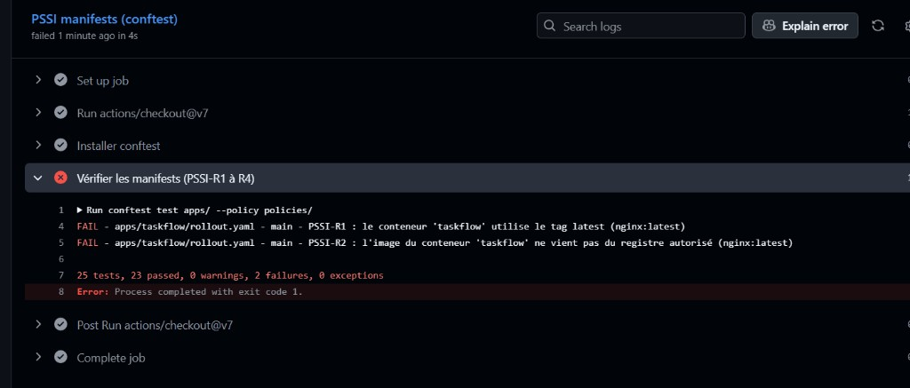

2. **Blocage Trivy (Règle R5)** : L'image \	askflow:2.2.0\ comportait des vulnérabilités connues (Starlette, urllib3). La pipeline a légitimement bloqué la PR en attendant une action.

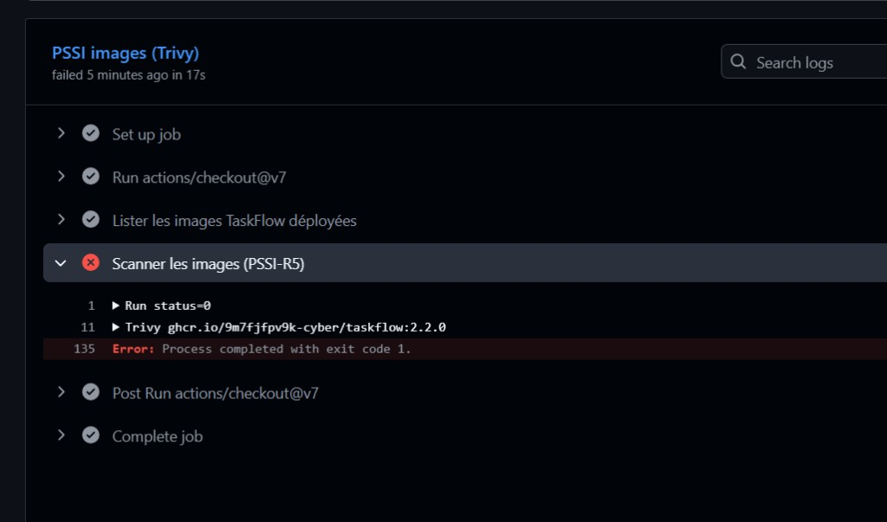

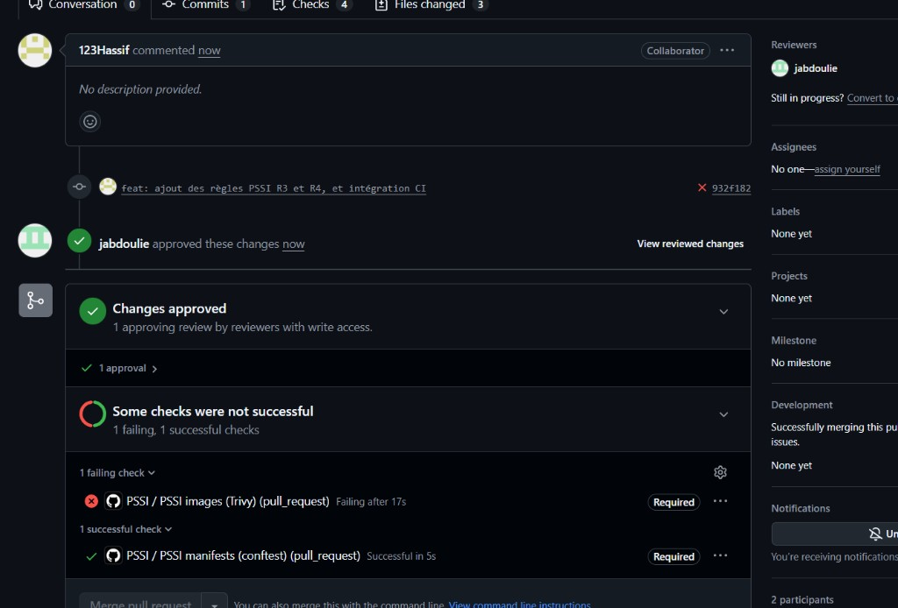

3. **Résolution finale** : Après restauration de l'image correcte et ajout des exceptions justifiées dans le fichier \.trivyignore\, la pipeline complète passe au vert et la PR est débloquée.

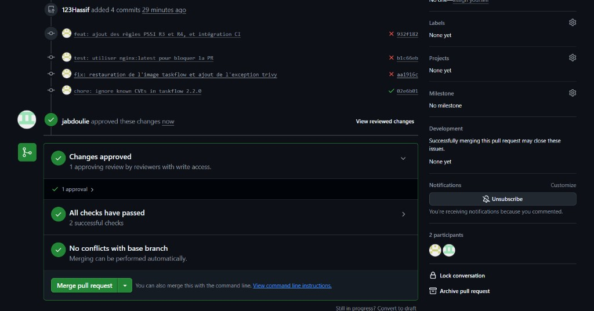
